<link href="https://fonts.googleapis.com/css2?family=Inter:wght@300;400;500;600;700&display=swap" rel="stylesheet">

<nav class="language-switch" aria-label="语言切换">
  <a href="/">English</a>
  中文
</nav>

你好！我是**王嘉琪**，英文名 Jackie，目前是[哈尔滨工业大学（深圳）](https://www.hitsz.edu.cn/)（HITSZ）与[鹏城实验室](https://www.pcl.ac.cn/)（PCL）联合培养的计算机科学与技术专业博士研究生，导师为[张治国教授](https://scholar.google.com/citations?hl=en&user=DAtNH6EAAAAJ&view_op=list_works&sortby=pubdate)和[马铮宇教授](https://scholar.google.com/citations?hl=en&user=21SR930AAAAJ&view_op=list_works&sortby=pubdate)。

我的研究关注类脑智能、脉冲神经网络以及神经/语音信号解码，代表性项目包括 [CET-MAE](https://github.com/JackieWang9811/CET-MAE)、[S^2M-Former](https://github.com/JackieWang9811/S2M-Former)、[SpikeSCR](https://github.com/JackieWang9811/SpikeSCR) 和 [SpikCommander](https://github.com/JackieWang9811/SCommander)。

我硕士毕业于[吉林大学](https://www.jlu.edu.cn/)控制科学与工程专业，导师为[陈万忠教授](https://dce.jlu.edu.cn/info/1182/9723.htm)。本科毕业于[东北电力大学](http://www.neepu.edu.cn/)自动化专业，导师为沈学强副教授。

我的中文简历：**[王嘉琪简历（CN）](../assets/WJQ_CV_CN.pdf)**。


[Google Scholar](https://scholar.google.com.hk/citations?hl=zh-CN&tzom=-480&user=jz4IkO0AAAAJ) ({{ metrics.google_scholar_citations }} 次引用) /
[GitHub](https://github.com/JackieWang9811) ({{ metrics.github_stars }} stars) /
[CSDN](https://blog.csdn.net/jq_98) ({{ metrics.csdn_views }} 访问) /

**Email**: mhwjq1998@gmail.com; **WeChat**: JackieWang9811

---

### 🔍 研究方向

我的研究主要关注：
- **脉冲神经网络（SNN）**
- **时序与序列建模**
- **脑机接口（BCI）**
- **语音与语言模型**

---

### 🤝 合作交流

我希望推动类脑智能以及**语音**和**神经**信号（EEG、ECG、EMG）解码技术的发展。  
如果你正在研究 SNN、BCI 解码、时序建模或高效神经网络架构，非常欢迎交流与合作！

欢迎通过邮件联系我。😊

**Coming soon:** 还有三篇论文正在路上，敬请期待！

## 🌟 代表项目
{: #featured-projects .section-title }

  <article class="project-card">
    

      AAAI 2026
      ★ 14
    

    <h3>SpikCommander</h3>
    
面向高效语音命令识别的高性能脉冲 Transformer。

    

      SNNSpeechTransformer
    

    

      <a href="https://arxiv.org/abs/2511.07883v1">Paper</a>
      <a href="https://github.com/JackieWang9811/SCommander">Code</a>
    

  </article>

  <article class="project-card">
    

      NeurIPS 2025
      ★ 7
    

    <h3>S2M-Former</h3>
    
用于脑听觉注意检测的脉冲对称混合 Branchformer。

    

      EEGBCIAttention
    

    

      <a href="https://arxiv.org/abs/2508.05164">Paper</a>
      <a href="https://github.com/JackieWang9811/S2M-Former">Code</a>
    

  </article>

  <article class="project-card">
    

      Neural Networks
      ★ 7
    

    <h3>SpikeSCR</h3>
    
结合脉冲神经网络与课程蒸馏的高效语音命令识别方法。

    

      SNNDistillationEfficient AI
    

    

      <a href="https://arxiv.org/abs/2412.12858">Paper</a>
      <a href="https://github.com/JackieWang9811/SpikeSCR">Code</a>
    

  </article>

  <article class="project-card">
    

      ACL 2024
      ★ 14
    

    <h3>CET-MAE</h3>
    
面向 EEG-to-Text 解码的对比式 EEG-文本掩码自编码预训练。

    

      EEG-to-TextMAERepresentation
    

    

      <a href="https://arxiv.org/abs/2402.17433">Paper</a>
      <a href="https://github.com/JackieWang9811/CET-MAE">Code</a>
    

  </article>

## 📝 代表性成果
{: #publications .section-title }

- AAAI 2026 [
SpikCommander: A High-performance Spiking Transformer with Multi-view Learning for Efficient Speech Command Recognition](https://arxiv.org/abs/2511.07883v1),
   <ins>**Jiaqi Wang**</ins>, Liutao Yu, Xiongri Shen, Sihang Guo, Chenlin Zhou, Leilei Zhao, Yi Zhong, Zhiguo Zhang\*, Zhengyu Ma\*   
  **_已被 AAAI 2026 Main Track 接收！_**  
  **Code:** [Link](https://github.com/JackieWang9811/SCommander)

- NeurIPS 2025 [
S&sup2;M-Former: Spiking Symmetric Mixing Branchformer for Brain Auditory Attention Detection](https://arxiv.org/abs/2508.05164),
   <ins>**Jiaqi Wang**</ins>, Zhengyu Ma\*, Xiongri Shen, Chenlin Zhou, Leilei Zhao, Han Zhang, Yi Zhong, Siqi Cai, Zhenxi Song, Zhiguo Zhang\*  
  **_ArXiv 2025.08  ➡️ 已被 NeurIPS 2025 Main Track 接收！_**  
  **Code:** [Link](https://github.com/JackieWang9811/S2M-Former) 

- Neural Networks [Efficient Speech Command Recognition Leveraging Spiking Neural Network and Curriculum Learning-based Knowledge Distillation](https://arxiv.org/abs/2412.12858),
   <ins>**Jiaqi Wang**</ins>,  Liutao Yu, Liwei Huang, Chenlin Zhou, Han Zhang, Zhenxi Song, Min Zhang, Zhengyu Ma\*, Zhiguo Zhang\*  
  **_ArXiv 2024.12  ➡️ 已被 Neural Networks 接收（2025.10）！_**  
  **Code:** [Link](https://github.com/JackieWang9811/SpikeSCR) 

- ACL 2024 [Enhancing EEG-to-Text Decoding through Transferable Representations from Pre-trained Contrastive EEG-Text Masked Autoencoder](https://arxiv.org/abs/2402.17433),
   <ins>**Jiaqi Wang**</ins>,  Zhenxi Song\*,  Zhengyu Ma, Xipeng Qiu, Min Zhang, Zhiguo Zhang\*  
  **_ArXiv 2024.02 ➡️ 已被 ACL 2024 Main Conference 接收！_**  
  **Code:** [Link](https://github.com/JackieWang9811/CET-MAE) 
    
- Biomedical Signal Processing and Control [A multi-classification algorithm based on multi-domain information fusion for motor imagery BCI](https://www.sciencedirect.com/science/article/pii/S1746809422007066),
  <ins>**Jiaqi Wang**</ins>, Wanzhong Chen, Mingyang Li\*  
  **_Biomedical Signal Processing and Control (BSPC) 2023.01_**

- CN Invention Patent [A human-like robot motion system and control method based on human body posture control](https://kns.cnki.net/kcms2/article/abstract?v=kxaUMs6x7-4I2jr5WTdXti3zQ9F92xu0nlgSAA876Br4k7Yiof5ge6un4lKDiSbV1SxF4BaaQuhTiBmtvRHVjHSjjN-2-bNX&uniplatform=NZKPT), <ins>**Jiaqi Wang**</ins>, Wanzhong Chen, Xiao Zheng 
  **_中国发明专利授权，2022.08_**

📖 **合作论文**

- AAAI 2026 Oral [Spikingformer: A Key Foundation Model for Spiking Neural Networks](https://openreview.net/forum?id=SmZTeHYlCa&referrer=%5BAuthor%20Console%5D(%2Fgroup%3Fid%3DAAAI.org%2F2026%2FConference%2FAuthors%23your-submissions)),
 Chenlin Zhou, Liutao Yu, Zhaokun Zhou, Han Zhang, <ins>**Jiaqi Wang**</ins>, Zhengyu Ma, Huihui Zhou, Yonghong Tian

- ArXiv [Temporal-adaptive Weight Quantization for Spiking Neural Networks](https://arxiv.org/abs/2511.17567),
 Han Zhang, Qingyan Meng, <ins>**Jiaqi Wang**</ins>, Baiyu Chen, Zhengyu Ma, Xiaopeng Fan

- Information Fusion 2026 [BrainCSD: A Hierarchical Consistency-Driven MoE Foundation Model for Unified Connectome Synthesis and Multitask Brain Trait Prediction](https://arxiv.org/abs/2511.05630),
 Xiongri Shen, <ins>**Jiaqi Wang**</ins>, Yi Zhong, Zhenxi Song, Leilei Zhao, Liling Li, Yichen Wei, Lingyan Liang, Shuqiang Wang, Baiying Lei, Demao Deng, Zhiguo Zhang

- Information Fusion 2026 [Pattern-Aware Diffusion Synthesis of fMRI/dMRI with Tissue and Microstructural Refinement](https://arxiv.org/abs/2511.04963),
 Xiongri Shen, <ins>**Jiaqi Wang**</ins>, Yi Zhong, Zhenxi Song, Leilei Zhao, Yichen Wei, Lingyan Liang, Shuqiang Wang, Baiying Lei, Demao Deng, Zhiguo Zhang

- ACL 2025 Findings [BrainECHO: Semantic Brain Signal Decoding through Vector-Quantized Spectrogram Reconstruction for Whisper-Enhanced Text Generation](https://arxiv.org/abs/2410.14971),
 Jilong Li, Zhenxi Song, <ins>**Jiaqi Wang**</ins>, Meishan Zhang, Honghai Liu, Min Zhang, Zhiguo Zhang

- MICCAI 2025 [Thread the Needle: Genomics-Guided Prompt-Bridged Attention Model for Survival Prediction of Glioma Based on MRI Images](https://arxiv.org/abs/2410.14971),
Yi Zhong, Xubin Zheng, Xiongri Shen, <ins>**Jiaqi Wang**</ins>, Leilei Zhao, Zhenxi Song, Zhiguo Zhang

## 🎓 教育经历
{: #education .section-title }

  

    

      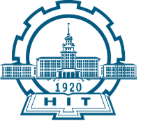
      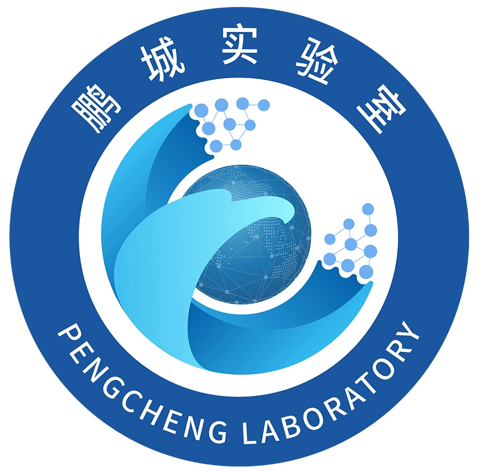
    

    

      <strong>哈尔滨工业大学（深圳）& 鹏城实验室</strong>  
        计算机科学与技术博士研究生（联合培养）  
        2023 至今
    

  

  

    

      
    

    

      <strong>吉林大学</strong>  
        控制科学与工程硕士  
        2020 至 2023
    

  

  

    

      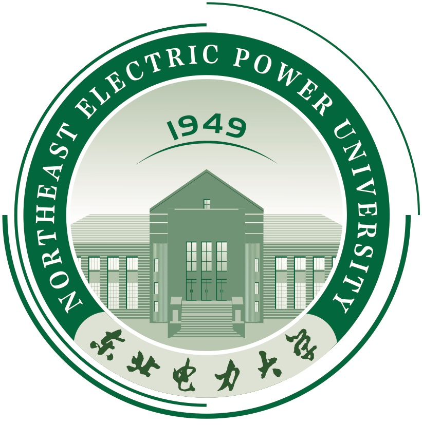
    

    

      <strong>东北电力大学</strong>  
        自动化学士  
        2016 至 2020
    

  

## 📚 学术服务
{: #academic-service .section-title }

我曾担任多个高水平 AI 会议与期刊的审稿人，包括：

**会议：** AAAI 2027; NeurIPS 2026; AAAI 2026; ACL ARR 2026/25（全年）; ICLR 2026/25; ICME 2026/25; ACM MM 2026/24; ICASSP 2026/23。 
**期刊：** IEEE TCSVT; Neurocomputing; Neuromorphic Computing and Engineering; IEEE TNSRE; IEEE TIM; Biomedical Signal Processing and Control, et al.

## 🔭 开源项目
{: #open-source-projects .section-title }

🧠 [Awesome Spiking Neural Networks](https://github.com/zhouchenlin2096/Awesome-Spiking-Neural-Networks)（600+ stars）  

**这是一个关于脉冲神经网络的论文列表，包含论文、代码与相关网站。**  

如果你拥有或发现尚未收录的 SNN 论文，欢迎通过 pull request 补充到该项目中。

## 🏢 工作经历
{: #work-experience .section-title }

- 近期持续参与产业界大规模 AI 系统与真实产品场景相关研究
- 2022.06 至 2022.08，华为 ICT（Optic Line）AI 工程师实习生，研究方向为 3D 计算机视觉与 FTTR

## ⭐ 奖励荣誉
{: #awards .section-title }

- 2026 受邀参加**小红书 REDstar 顶尖人才计划技术沙龙**
- 2026 受邀参加**淘宝/淘天 Star 计划**
- 2023 奇安信公益奖学金，吉林大学仅 4 人获奖
- 2023 吉林大学优秀硕士毕业生，Top 6%
- 2022 研究生国家奖学金，Top 6%
- 2022 吉林大学优秀研究生二等奖
- 2021 吉林大学优秀研究生二等奖
- 2021 吉林大学优秀研究生，Top 4%
- 2021 “华为杯”第十八届中国研究生数学建模竞赛三等奖
- 2021 吉林大学研究生学业奖学金
- 2020 吉林大学研究生学业奖学金
- 2020 东北电力大学优秀毕业生
- 2019 东北电力大学优秀学生一等奖学金
- 2019 东北电力大学优秀学生

这些学术与产业经历让我持续连接前沿研究、真实场景与技术创新。

## 📸 高光时刻
{: #highlights .section-title }

这里记录了我科研旅程中的一些片段：

  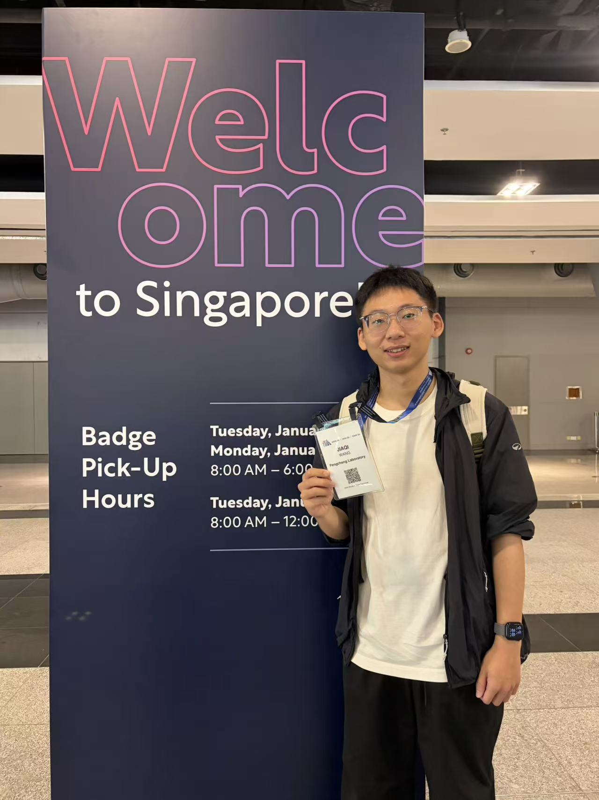
  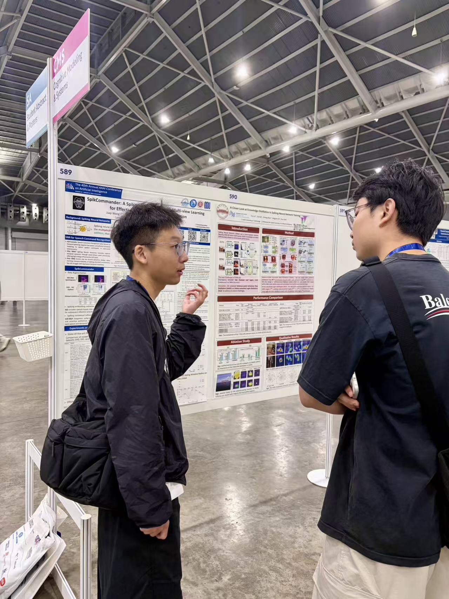
  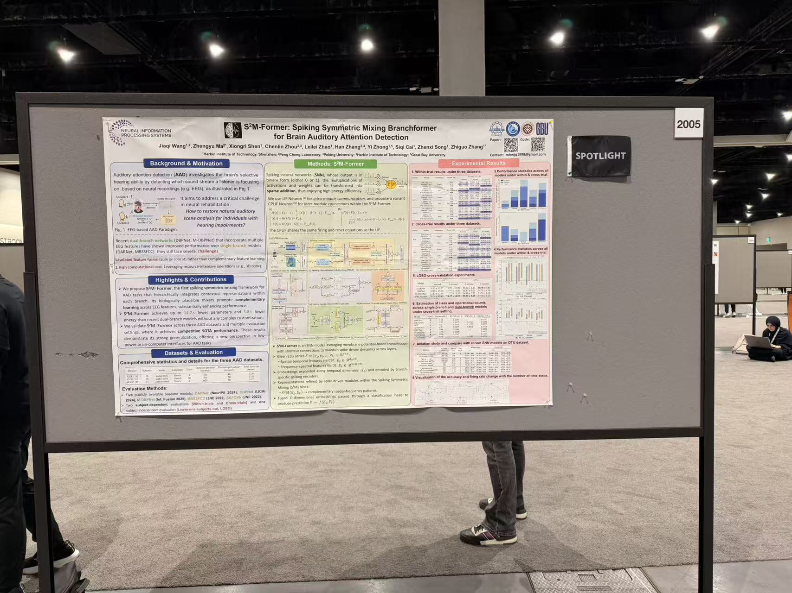
  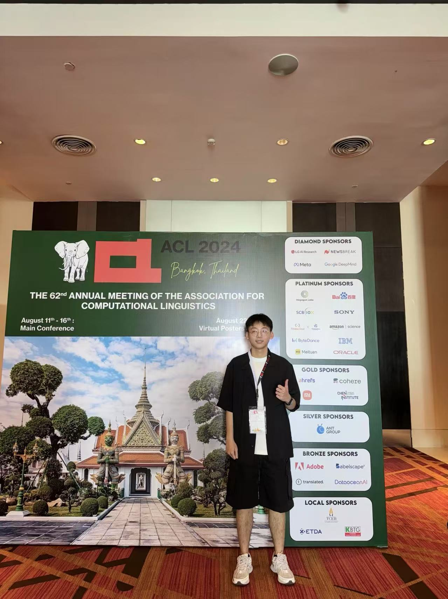
  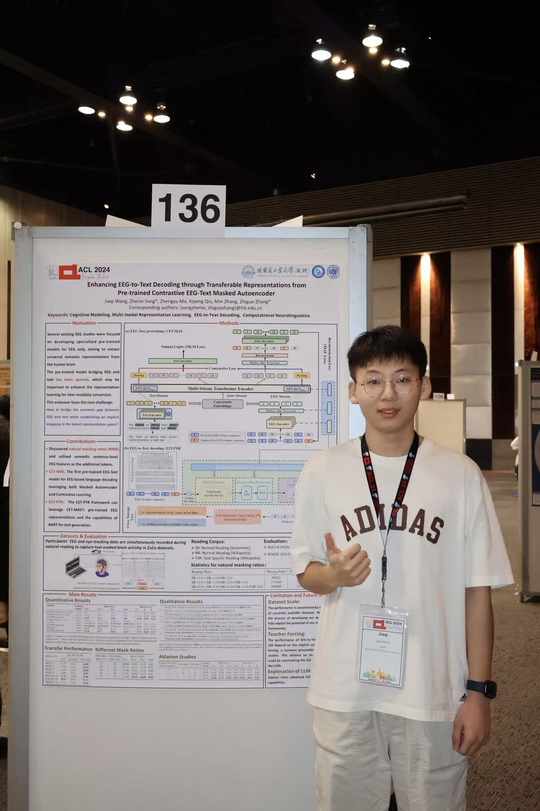
  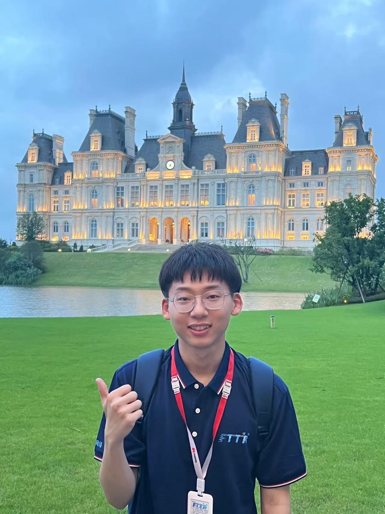
  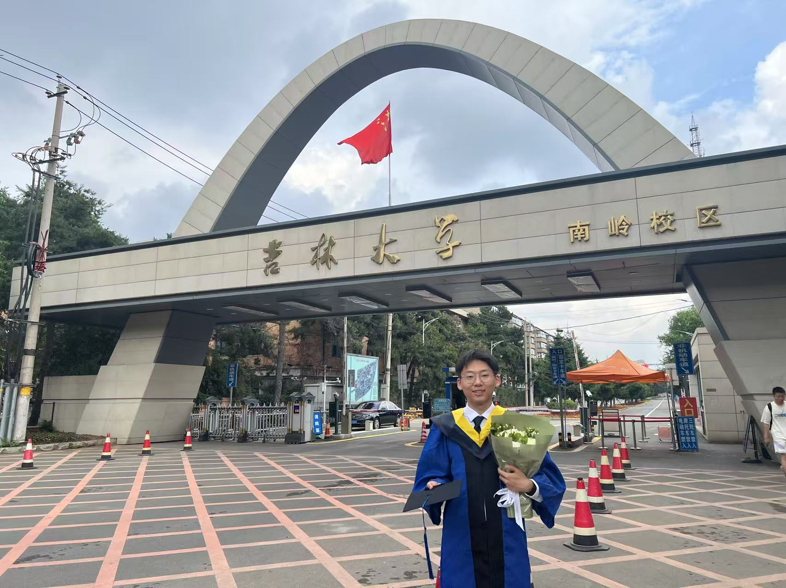
  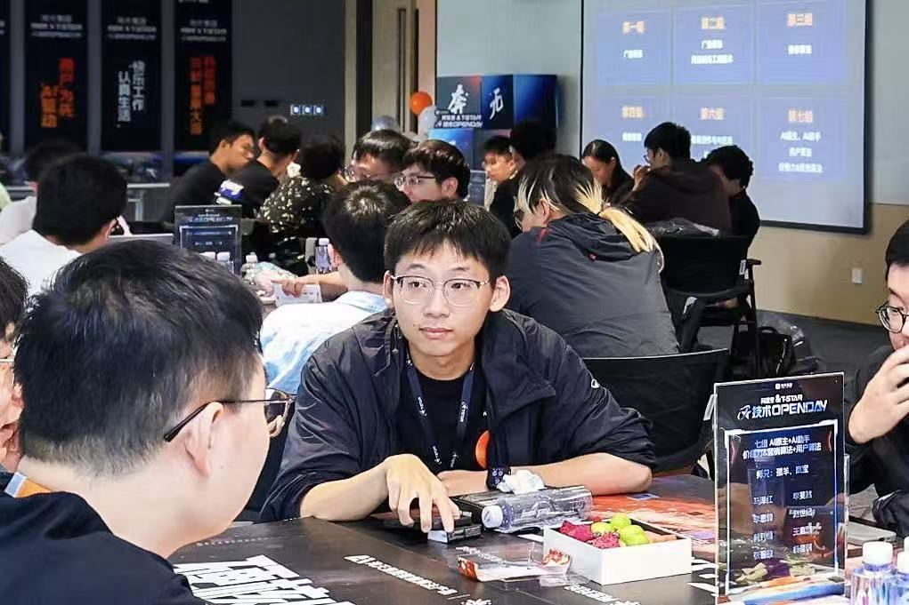
  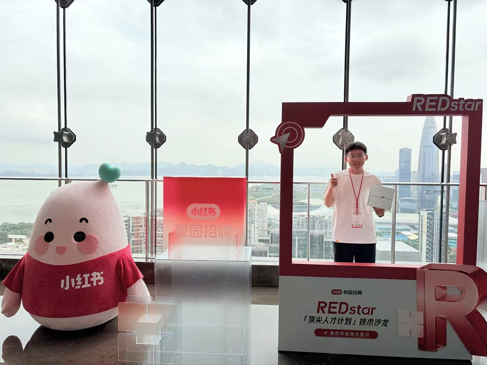

