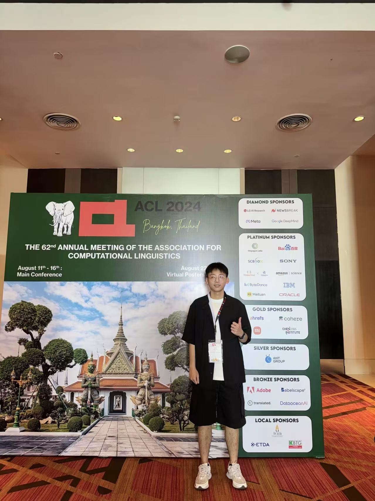
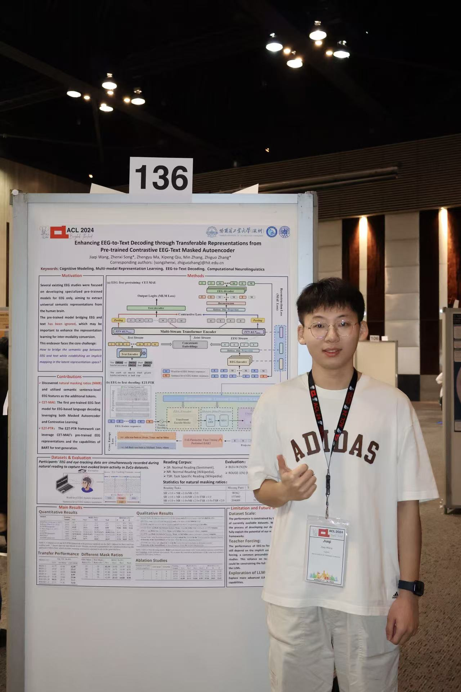
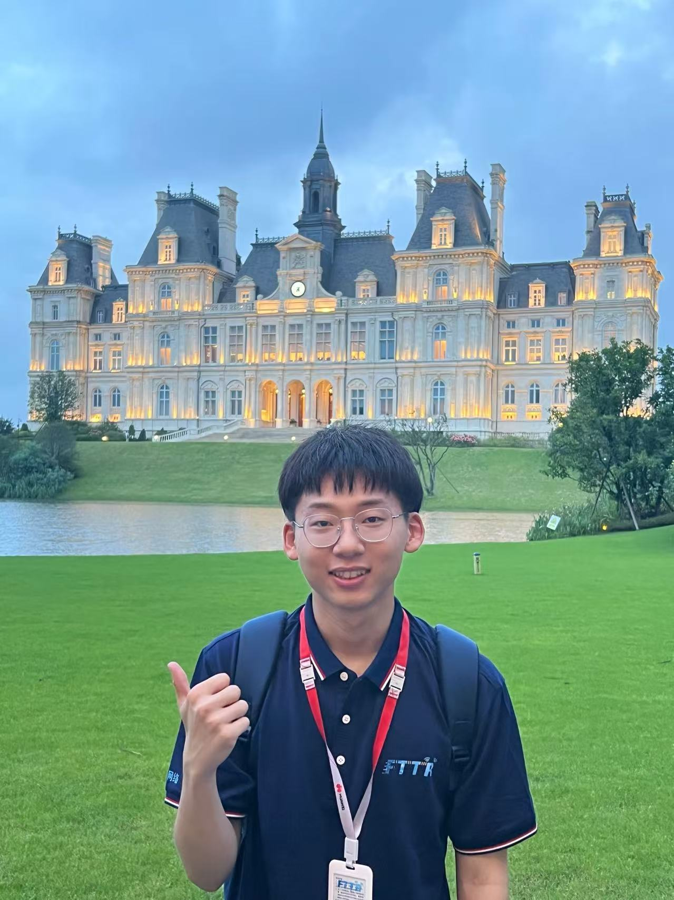
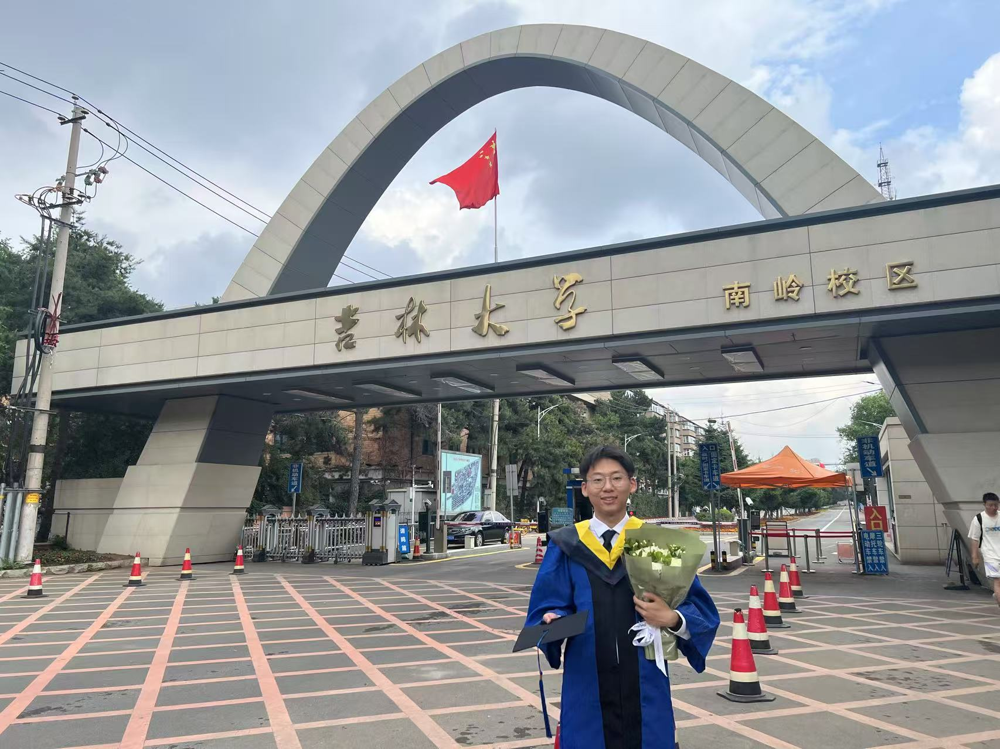

# 🙋‍♂️ About Me

Hi! I'm **Jiaqi Wang**. You can call me Jackie, which sounds like Jiaqi. I'm a third-year Ph.D. student in Computer Science and Technology joint-programmed by the [Harbin Institute of Technology (Shenzhen)](https://www.hitsz.edu.cn/) (HITSZ), and the [Pengcheng Laboratory](https://www.pcl.ac.cn/) (PCL), now working with Prof.[Zhiguo Zhang](http://faculty.hitsz.edu.cn/zgzhang) & Prof.[Zhengyu Ma](https://scholar.google.com/citations?hl=en&user=21SR930AAAAJ&view_op=list_works&sortby=pubdate). 
I obtained my master's degree in the School of Communication Engineering at [Jilin University](https://www.jlu.edu.cn/) (JLU), where I worked with Prof.[Wanzhong Chen](https://dce.jlu.edu.cn/info/1182/9723.htm).
I obtained my bachelor's degree in the School of Automation at [Northeast Electric Power University](http://www.neepu.edu.cn/) (NEEPU), where I worked with Associate Prof.Xueqiang Shen.

You can find my CV here: [Jiaqi Wang's CV (CN) ](../assets/CV_zn.pdf).

[Google Scholar](https://scholar.google.com.hk/citations?hl=zh-CN&tzom=-480&user=jz4IkO0AAAAJ) /  [Github](https://github.com/JackieWang9811) / [CSDN](https://blog.csdn.net/jq_98) / [Email](mailto:mhwjq1998@gmail.com)

# 💡Research Interests

- Spiking Neural Network (SNN)
- Brain-Computer Interface (BCI)
- Temporal and Sequential Modeling
- Speech and Language Models

# 🤝 Call for Collaboration

I am eager to join forces with researchers in advancing neural network technologies! My focus areas include **Spiking Neural Networks (SNN)**, time series representation learning, and pioneering decoding techniques for **speech and EEG** signals. I warmly welcome colleagues and research teams passionate about these fields to connect and explore collaboration opportunities!

# 📝 Publications 

-  AAAI 2026  [
SpikCommander: A High-performance Spiking Transformer with Multi-view Learning for Efficient Speech Command Recognition](https://arxiv.org/abs/2511.07883v1)),
   <ins>**Jiaqi Wang**</ins>, Liutao Yu, Xiongri Shen, Sihang Guo, Chenlin Zhou, Leilei Zhao, Yi Zhong, Zhengyu Ma*, Zhiguo Zhang*  
  **_Accepted by AAAI 2026 (Main Track)!_**  
  **Code:** [Link](https://github.com/JackieWang9811/SpikCommander)
-  NeurIPS 2025 [
S&sup2;M-Former: Spiking Symmetric Mixing Branchformer for Brain Auditory Attention Detection](https://arxiv.org/abs/2508.05164),
   <ins>**Jiaqi Wang**</ins>, Zhengyu Ma*, Xiongri Shen, Chenlin Zhou, Leilei Zhao, Han Zhang, Yi Zhong, Siqi Cai, Zhenxi Song, Zhiguo Zhang*  
  **_ArXiv 2025.08  ➡️ Accepted by NeurIPS 2025 (Main Track)!_**  
  **Code:** [Link](https://github.com/JackieWang9811/S2M-Former) (To be released by the end of 2025.)
- Neural Networks [Efficient Speech Command Recognition Leveraging Spiking Neural Network and Curriculum Learning-based Knowledge Distillation](https://arxiv.org/abs/2412.12858),
   <ins>**Jiaqi Wang**</ins>,  Liutao Yu, Liwei Huang, Chenlin Zhou, Han Zhang, Zhenxi Song, Min Zhang, Zhengyu Ma*, Zhiguo Zhang*  
  **_ArXiv 2024.12  ➡️ Accepted by Neural Networks (2025.10)!_**  
  **Code:** [Link](https://github.com/JackieWang9811/SpikeSCR) (To be released by the end of 2025.)

- ACL 2024 [Enhancing EEG-to-Text Decoding through Transferable Representations from Pre-trained Contrastive EEG-Text Masked Autoencoder](https://arxiv.org/abs/2402.17433),
   <ins>**Jiaqi Wang**</ins>,  Zhenxi Song*,  Zhengyu Ma, Xipeng Qiu, Min Zhang, Zhiguo Zhang*  
  **_ArXiv 2024.02 ➡️ Accepted by ACL 2024 (Main Conference)!_**  
  **Code:** [Link](https://github.com/JackieWang9811/CET-MAE) 
    
 - BSPC [A multi-classification algorithm based on multi-domain information fusion for motor imagery BCI](https://www.sciencedirect.com/science/article/pii/S1746809422007066),
  <ins>**Jiaqi Wang**</ins>, Wanzhong Chen, Mingyang Li*  
  **_Biomedical Signal Processing and Control (BSPC) 2023.01_**

 - CN Invention Patent [A human-like robot motion system and control method based on human body posture control](https://kns.cnki.net/kcms2/article/abstract?v=kxaUMs6x7-4I2jr5WTdXti3zQ9F92xu0nlgSAA876Br4k7Yiof5ge6un4lKDiSbV1SxF4BaaQuhTiBmtvRHVjHSjjN-2-bNX&uniplatform=NZKPT), <ins>**Jiaqi Wang**</ins>, Wanzhong Chen, Xiao Zheng 
  **_Granted Chinese Invention Patent 2022.08_**

📖 Co-authored Publications

- AAAI 2026 Oral [Spikingformer: A Key Foundation Model for Spiking Neural Networks](https://openreview.net/forum?id=SmZTeHYlCa&referrer=%5BAuthor%20Console%5D(%2Fgroup%3Fid%3DAAAI.org%2F2026%2FConference%2FAuthors%23your-submissions)),
 Chenlin Zhou, Liutao Yu, Zhaokun Zhou, Han Zhang, <ins>**Jiaqi Wang**</ins>, Zhengyu Ma, Huihui Zhou, Yonghong Tian 
- ACL 2025 Findings [BrainECHO: Semantic Brain Signal Decoding through Vector-Quantized Spectrogram Reconstruction for Whisper-Enhanced Text Generation](https://arxiv.org/abs/2410.14971),
 Jilong Li, Zhenxi Song, <ins>**Jiaqi Wang**</ins>, Meishan Zhang, Honghai Liu, Min Zhang, Zhiguo Zhang
- MICCAI 2025 [Thread the Needle: Genomics-Guided Prompt-Bridged Attention Model for Survival Prediction of Glioma Based on MRI Images](https://arxiv.org/abs/2410.14971),
Yi Zhong, Xubin Zheng, Xiongri Shen, <ins>**Jiaqi Wang**</ins>, Leilei Zhao, Zhenxi Song, Zhiguo Zhang

# 📚 Review Experience
I have experience in reviewing for high-impact AI conferences and journals, including:  

**Conferences:**  

- Invited reviewer for ACL 2025 ARR (October)
- Invited reviewer for ICLR 2026 
- Program Committee for AAAI 2026
- ACL 2025 ARR (July)
- ICLR 2025
- ACL 2025 ARR (Feb)
- ACL 2025 ARR (May)
- ICME 2025
- ACM MM 2024
- ICASSP 2023

  
**Journals:**
- Invited reviewer for Neuromorphic Computing and Engineering (NCE)
- IEEE TNSRE
- IEEE TIM
- BSPC

# 🔭 Open Source Projects

🧠 [Awesome Spiking Neural Networks](https://github.com/zhouchenlin2096/Awesome-Spiking-Neural-Networks)  (More than 600 stars)

  **A paper list of spiking neural networks, including papers, codes, and related websites.**

  If you own or find some overlooked SNN papers, we welcome you to add them to this document by pull request.

# 🏢 Work Experience

* Jun 2022 - Aug 2022, AI Engineer Intern, **Huawei ICT(Optic Line)**,  3D Computer Vision & FTTR

# ⭐ Awards

* 2023 **Qianxin Social Scholarship** - **only four awardees in Jilin University**
* 2023 **Excellent Master Graduate of Jilin University** - Top 6%
* 2022 **National scholarship for Postgraduates** - Top 6%
* 2022 2nd Prize of Jilin University Excellent Postgraduate 
* 2021 2nd Prize of Jilin University Excellent Postgraduate
* 2021 **Excellent Postgraduate of Jilin University**  - Top 4%
* 2021 3nd Prize of "Huawei Cup" The 18th China Post-Graduate Mathematical Contest in Modeling 
* 2021 Postgraduate Scholarship of Jilin University 
* 2020 Postgraduate Scholarship of Jilin University
* 2020 Outstanding Graduate of NEEPU
* 2019 First-class Scholarship for Outstanding Students of NEEPU
* 2019 Outstanding Student of NEEPU

# 📸 Photo Gallery

Here are some moments and highlights of my journey:

  
  
  
  

# 🌐 Welcome Visitors

